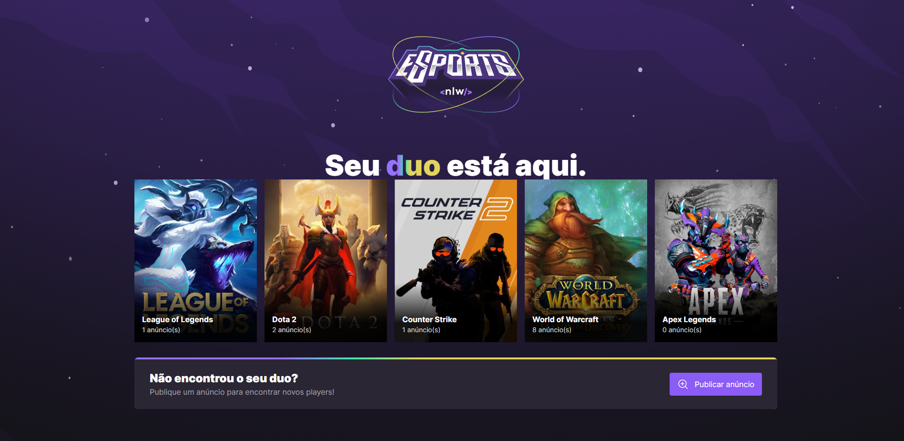

<div align="center" style="margin-bottom: 20px;">


</div>

<div align="center" style="margin: 20px;">

</div>

## The Project

An application that creates interaction between players and their respective games where you can bring them together at certain times so they can have fun.

##  About the Application

###  Features

- Simple interface

- Modal interface

- Carousel

- Components

- API


### Used Technologies

Some of the technologies used in this project are:
- [TypeScript](https://www.typescriptlang.org/)
- [ReactJS](https://pt-br.reactjs.org/)
- [TailwindCSS](https://tailwindcss.com/)
- [Vite](https://vitejs.dev/)
{...}

##  Running the Project
#### Clone Repository
```sh
$ git clone https://github.com/AlexandreeDev/eSports

```

#### Starting the web
```
$ npm run dev &&  yarn dev
```


<p align="center" style="margin-top: 20px; border-top: 1px solid #eee; padding-top: 20px;">Made with :purple_heart: by <strong> Alexandre J. Ferreira</strong> </p>